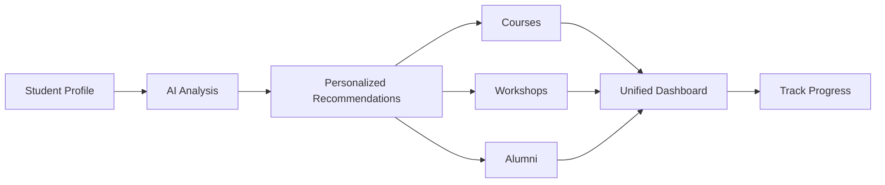

# AI-Powered-Academic-Career-Planning-Platform
TrojanNAV is an AI-powered platform designed to transform the academic and career planning experience for USC Marshall MSBA students.

# TrojanNAV 

> AI-Powered Academic & Career Planning Platform for USC Marshall MSBA Students

> **[👉 View Interactive Prototype](https://www.figma.com/make/gl20OVRRRb6xki8ebM6iS9/Figma_Prototype?fullscreen=1&t=u1c1tH1EBrxVKPNc-1)**
---

## Problem

MSBA students face **scattered resources** and **information overload** when planning their academic journey:

- **Vague course descriptions** → Students pick electives blindly
- **Unclear workshop value** → Miss critical skill-building opportunities  
- **Ineffective alumni networking** → Waste time with no response
- **Hours of trial-and-error** → Frustration and uncertainty

**Result:** Students know where they want to go, but don't know how to get there.

---

## Solution

**TrojanNAV** consolidates everything into one intelligent platform that provides:

### Core Features

| Feature | What It Does |
|---------|-------------|
|  **Smart Course Recommendations** | AI suggests electives based on your background + career goals, with professor reviews integrated |
|  **Workshop Discovery** | Get personalized workshop recommendations that fill your specific skill gaps |
|  **Alumni Matching** | AI connects you with relevant alumni based on career path similarity |
|  **Unified Calendar** | One place for courses, workshops, networking events + progress tracking |

---

## Who We Built This For

**Meet Emily** - First-Year MSBA Student

-  **Goal:** Break into Data Analytics
-  **Challenges:** 
  - Overwhelmed by scattered resources
  - Unsure which electives build the right skills
  - Doesn't know which alumni to connect with
-  **With TrojanNAV:** Confident, informed decisions backed by data

---

## 🚀 How It Works

### User Journey

1. **Profile Setup** → Input background, skills, target role
2. **Get Recommendations** → AI analyzes and suggests personalized pathways
3. **Make Decisions** → See transparent rationale + peer reviews
4. **Track Progress** → Monitor milestones and skill development
5. **Connect & Grow** → Network with matched alumni

---

## Key Screens

> **[👉 View Interactive Prototype](https://www.figma.com/make/gl20OVRRRb6xki8ebM6iS9/Figma_Prototype?fullscreen=1&t=u1c1tH1EBrxVKPNc-1)**

### Dashboard Overview
Central hub showing personalized recommendations and upcoming events

### Course Planner
Smart elective suggestions with professor ratings and skill mapping

### Alumni Network
AI-matched alumni profiles with career paths and contact options

---

## 🛠️ Technical Stack

- **AI Engine:** Machine learning recommendation algorithms
- **Data Integration:** USC courses + RateMyProfessor + Alumni database
- **Architecture:** Modular, scalable design for phased rollout
- **Frontend:** User-centered, intuitive dashboard

---

## Roadmap

| Phase | Focus | Timeline |
|-------|-------|----------|
| **Phase 1** | MVP with MSBA pilot | Current |
| **Phase 2** | Real data integration | Next semester |
| **Phase 3** | Expand to MBA program | Year 2 |
| **Phase 4** | Marshall-wide integration | Year 3 |

---

## Team

**C4 Team Members:**
- Xiaoyu Ma
- Melody Chen
- Dat Nguyen
- Tony Hung
- Zhengyuan Pei
- Sean Lin

---

## 📁 Project Resources

- [📝 Project Brief](./Project_Brief.pdf)
- [📊 Presentation Slides](./Slides.pdf)
- [🎨 Figma Prototype](https://www.figma.com/make/gl20OVRRRb6xki8ebM6iS9/Figma_Prototype?fullscreen=1&t=u1c1tH1EBrxVKPNc-1) - **Interactive Demo**

---

## 🎓 Academic Context

**Course:** AI-CaseCom  
**Institution:** USC Marshall School of Business  
**Program:** Master of Science in Business Analytics (MSBA)

  Built with ❤️ by C4 Team | USC Marshall 2024-2025

